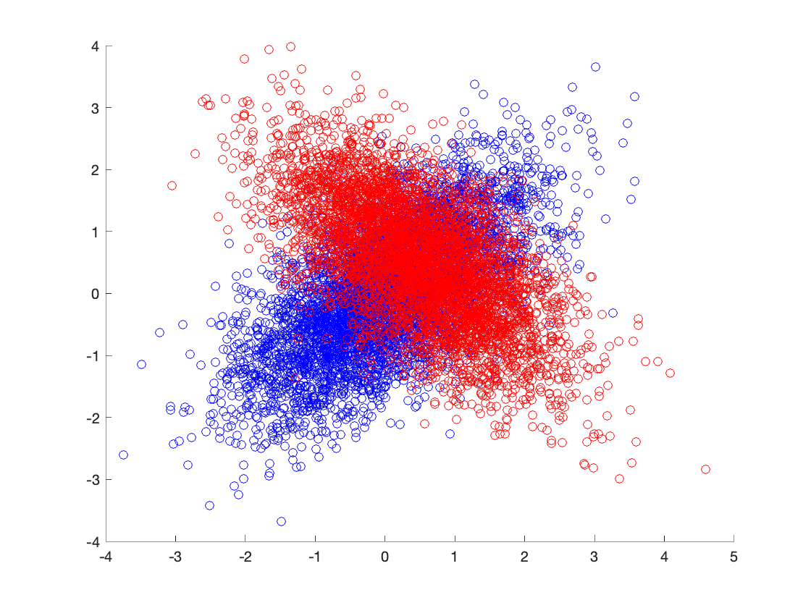
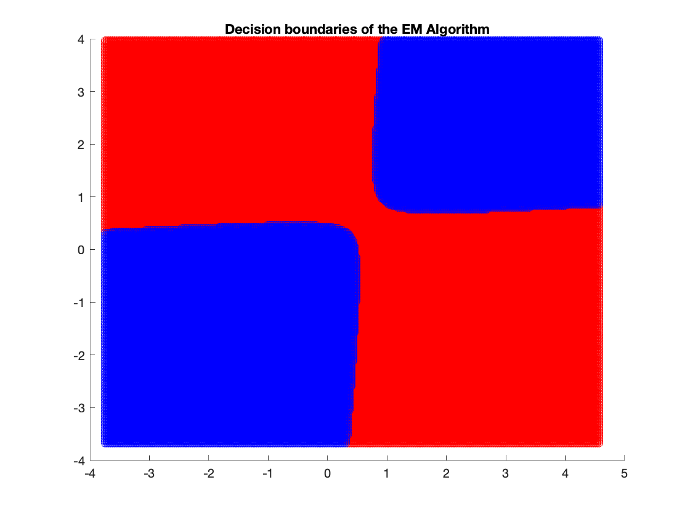
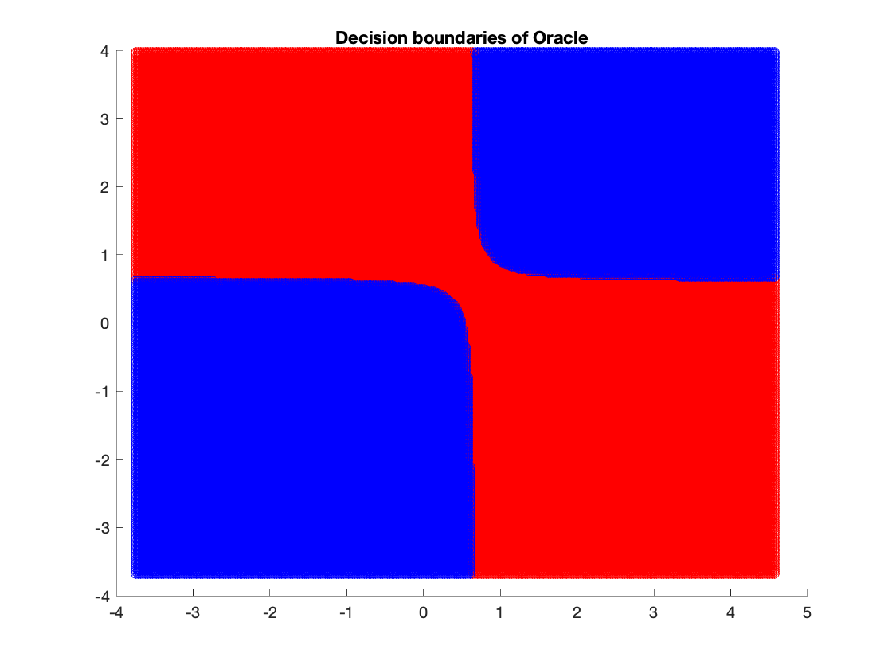

# Expectation-Maximization-Algorithm

Main purpose of the algorithm is estimating parameters of probability distribution functions in a data driven manner.

It consists of two steps as its name suggested. 
### Expectation Step
Finds the probability of the data coming from the distribution with current parameters.

### Maximization Step
Provides a new estimate of parameters.

These two steps are going to be repeated until convergence is achieved. In this repository, I demonstrate the algorithm in Mixture Gaussians. Given a data from Mixture Gaussians of 2, the algorithm is going to estimate priors, means, and variances.

After that, it is going to perform a binary hypothesis testing and be compared with "the oracle" model.
It can be seen that from the detection and false alarm rates, the EM Algorithm performs very well in Gaussian Mixtures.

  

